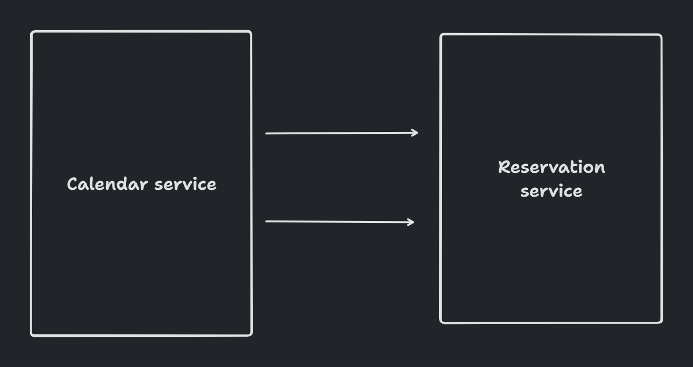
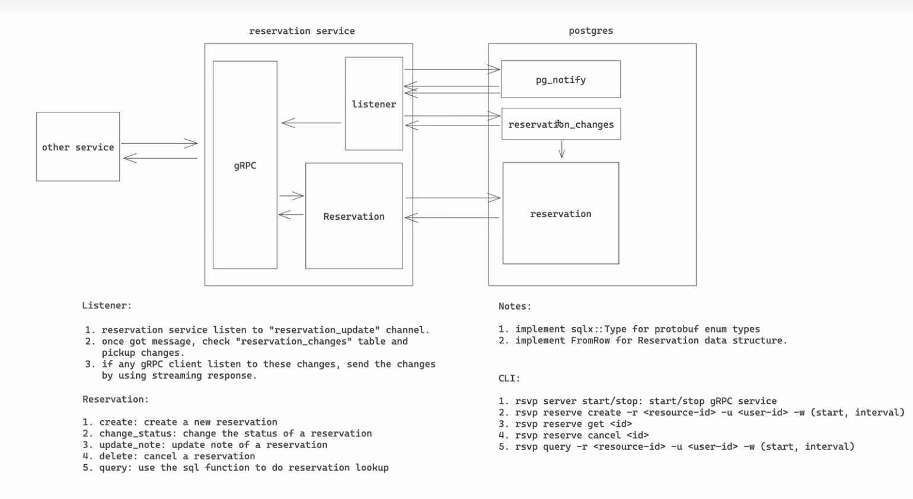

# Core Reservation

- Feature Name: core-reservation
- Start Date: 2023-12-05 12:45

## Summary

A core reservation service that solves the problem of reserving a resource for a period of time. We leverage postgres EXCLUDE constraints to ensure that only one reservation can be made for a given resource at a given time.

## Motivation

We need a common solution for varions reservation requirements: 1) calendar booking; 2) hotel/room booking; 3) meeting room booking; 4) parking lot booking; 5) etc. Repeatedly building features for these requirements is a waste of time and resources. We should have a common solution that can be used by all teams.

## Guide-level explanation

### Basic Arch



### Service interface

We would use gRPC as a service interface. Blow is the proto definition:

```proto
enum ReservationStatus {
  UNKNOWN = 0;
  PENDING = 1;
  CONFIRMED = 2;
  BLOCKED = 3;
}

enum ReservationUpdateType {
  UNKNOWN = 0;
  CREATE = 1;
  UPDATE = 2;
  DELETE = 3;
}

message Reservation {
  string id = 1;
  string user_id = 2;
  ReservationType rtype = 3

  // resource  reservation window
  string resource_id = 4;
  google.protobuf.Timestamp start = 5;
  google.protobuf.Timestamp end = 6;

  // extra note
  string note = 7;
}

message ReserveRequest {
  Reservation reservation = 1;
}

message ReserveResponse {
  Reservation reservation = 1;
}

message ConfirmRequest {
  Reservation reservation = 1;
}

message ConfirmResponse {
  Reservation reservation = 1;
}

message UpdateRequest {
  string note = 1;
}

message UpdateResponse {
  Reservation reservation = 1;
}

message CancelRequest {
  string id = 1;
}

message CancelResponse {
  Reservation reservation = 1;
}

message GetRequest {
  string id = 1;
}

message GetResponse {
  Reservation reservation = 1;
}

message QueryRequest {
  string resource_id = 1;
  string user_id = 2;
  // use status to filter result. If UNKNOWN, return all reservations
  ReservationStatus status = 3;
  google.protobuf.Timestamp start = 4;
  google.protobuf.Timestamp end = 5;
}

message ListenRequest {

}

message ListenResponse {
  int8 op = 1;
  Reservation reservation = 2;
}

service ReservationService {
  rpc reserve(ReserveRequest) returns (ReserveResponse);
  rpc confirm(ConfirmRequest) returns (ConfirmResponse);
  rpc update(UpdateRequest) returns (UpdateResponse);
  rpc cancel(CancelRequest) returns (CancelResponse);
  rpc get(GetRequest) returns (GetResponse);
  rpc query(QueryRequest) returns (stream Reservation);
  // another system could monitor newly added/confirmed/cancelled reservations
  rpc listen(ListenRequest) returns (stream Reservation);
}
```

### Database schema

We use postgres as the database. Below is the schema:

```sql
CREATE SCHEMA rsvp;

CREATE TYPE rsvp.reservation_status as ENUM
 ('unknown', 'pending', 'confirmed', 'blocked');
CREATE TYPE rsvp.reservation_update_type AS ENUM (
  'unknown', 'create', 'update', 'delete'
);

CREATE TABLE rsvp.reservations (
  id uuid NOT NULL DEFAULT uuid_generate_v4(),
  user_id VARCHAR(64) NOT NULL,
  status rsvp.reservation_status NOT NULL DEFAULT 'pending',

  resource_id VARCHAR(64) NOT NULL,

  timespan TSTZRANGE NOT NULL,

  note TEXT,

  CONSTRAINT reservation_pkey PRIMARY KEY (id),
  CONSTRAINT reservation_conflict EXCLUDE
  USING gist (resource_id WITH =, timespan WITH &&)
);

CREATE INDEX reservations_resource_id_idx ON rsvp.reservations (resource_id);

CREATE INDEX reservations_user_id_idx ON rsvp.reservations (user_id);

-- if user_id is null, find all reservations within during for the resource
-- if resource_id is null, find all reservations within during for the user
-- if both are null, find all reservations winth during
-- if both set, find all reservations within during for the resource and user
CREATE OR REPLACE FUNCTION rsvp.query(user_id text, resource_id text,
during: tstzrange)
RETURNS TABLE rsvp.reservations AS $$ $$ LANGUAGE plpgsql;

-- reservation change queue
CREATE TABLE rsvp.reservation_changes (
  id SERIAL NOT NULL,
  reservation_id uuid NOT NULL,
  op rsvp.reservation_update_type NOT NULL,
);

-- trigger for add/update/delete a reservation
CREATE OR REPLACE FUNCTION rsvp.reservations_trigger() RETURNS TRIGGER AS $$
BEGIN
  IF TG_OP = 'INSERT' THEN
    INSERT INTO rsvp.reservation_changes (reservation_id, op) VALUES
    (NEW.id, 'create');
  ELSEIF TG_OP = 'UPDATE' THEN
    IF OLD.status <> NEW.status THEN
      INSERT INTO rsvp.reservation_chanegs (reservation_id,op)
      VALUES (NEW.id, 'update');
    END IF;
  ELSEIF TG_OP = 'DELETE' THEN
    INSERT INFO rsvp.reservation_changes (reservation_id,op)
    VALUES (OLD.id, 'delete');
  END IF;
  -- notify a channel called reservation_update
  NOTIFY reservation_update;
  RETURN NULL;
END
$$ LANGUAGE plpgsql;

CREATE TRIGGER reservations_trigger
  AFTER INSERT OR UPDATE OR DELETE ON rsvp.reservations
  FOR EACH ROW EXECUTE PROCEDURE rsvp.reservations_trigger();
```

## Core flow


